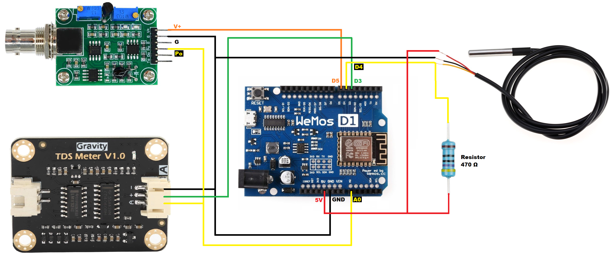

# aquarium
Angular application for monitoring and controlling Arduino peripherals in aquarium. PH, TDS, temperature.

This application is being developped for my aquarium and it might help someone who is starting to learn Arduino and want to make some home IoT usage.

Below is schema of connection with WeMos board

